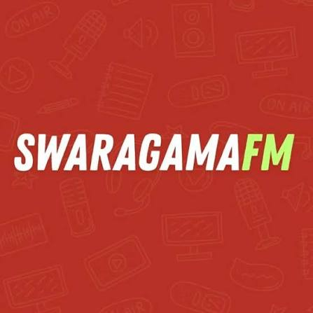

<h3 style="margin: 0; padding-top: 5px;">SWARAGAMA</h3>
<strong>Media & Digital Platform</strong> 
<em>Pusat informasi, hiburan, dan penyiaran digital.</em>
 

## 🏢 Profil Perusahaan
**Swaragama Group** adalah perusahaan media dan penyiaran terkemuka yang berpusat di Yogyakarta. Berakar kuat sebagai stasiun radio anak muda terfavorit, Swaragama kini telah bertransformasi menjadi platform media multi-saluran dan ekosistem digital yang dinamis. 

Swaragama menyajikan informasi terkini, hiburan, musik, dan gaya hidup yang relevan untuk generasi muda. Dengan semangat inovasi, Swaragama Group terus memperluas jangkauannya melalui berbagai kanal digital untuk memastikan audiens selalu terhubung, terinspirasi, dan terhibur di mana pun mereka berada.

## 💻 Peran Divisi Web Development
Repositori GitHub ini dikelola oleh **Divisi Web Development**, tim teknis di balik layar yang bertugas membangun infrastruktur digital Swaragama. Divisi ini bertugas menerjemahkan visi kreatif perusahaan ke dalam solusi teknologi yang andal.

Sebagai pilar digital perusahaan, tanggung jawab utama yang dijalankan meliputi:
- **🛠️ Pengembangan Platform Utama:** Membangun dan merawat arsitektur *website*, portal berita, dan antarmuka (UI/UX) digital Swaragama.
- **⚙️ Layanan & Infrastruktur:** Mengelola *backend* dan integrasi sistem.
- **🔒 Keamanan & Optimasi:** Memastikan ketersediaan layanan (*uptime*), kecepatan akses, serta keamanan data pengguna.

## 🚀 Tech Stack & Tools
Berikut adalah teknologi utama yang digunakan dalam pengembangan ekosistem website swaragama:

[nyusul sisanya]

## 📂 Navigasi Repositori
Untuk membantu Anda memahami arsitektur dan panduan pengembangan, berikut adalah repositori utama organisasi ini:

*   📌 **[`website-docs`](https://github.com/swaragamagroup/website-docs)** — Laporan Progres, Laporan Hasil Proyek, dan Draft Dokumen, serta Notulensi meeting.
---

  <i>Building and maintaining the digital ecosystem and software solutions behind Swaragama.</i>

